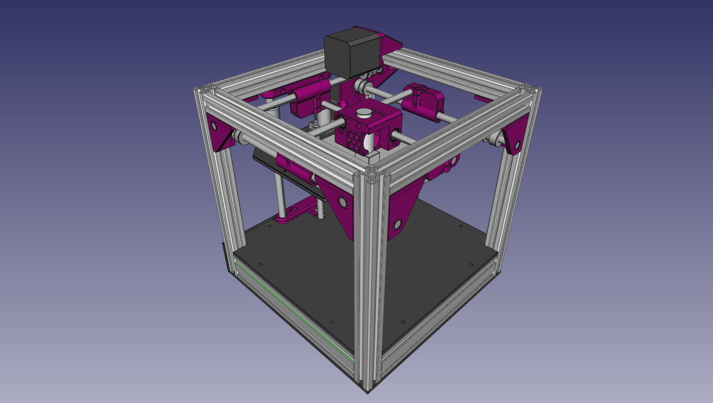

## Pixel Printer
This is a 3d Printer inspired by [wolfepr's Printer-Kitten](https://github.com/woolfepr/Printer-Kitten) while using more standard Nema17 Motors.

This Printer was intended to replace my Printrbot Simple while using all of it's electronics (hence the Nema17 Motors), but I gave that one to a Friend in need. 
That means, that this printer has never been built and I can't guarantee that all Parts work as I imagined. 

Nevertheless, if you are daring enough to try and build it, let me 
know and I might be able to give you more insights. 

Licensed under Creative Commons BY-NC-SA. 
 
